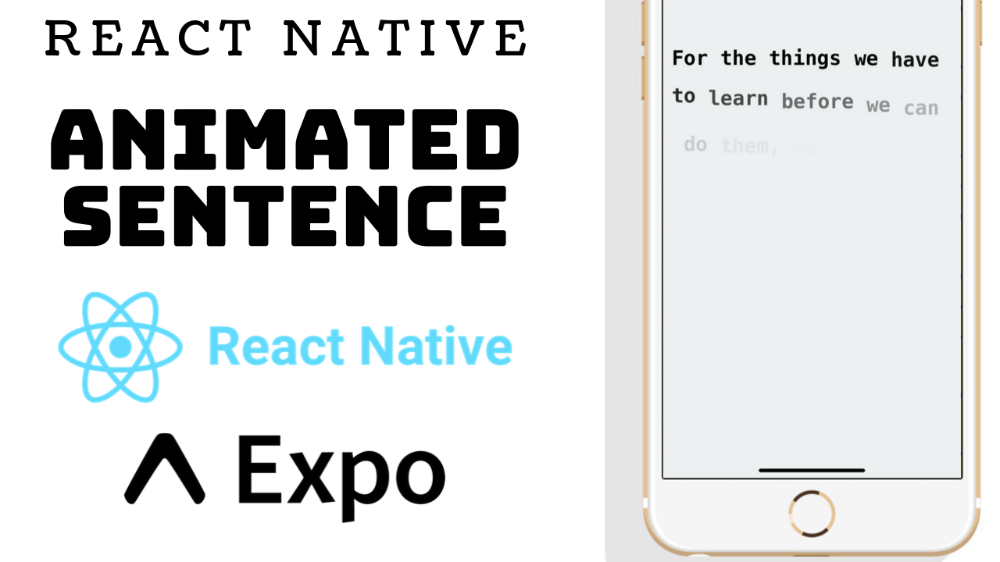

### Would you like to support me?

- Paypal: https://paypal.me/catalinmiron

# React Native Animated Sentence

# Run on your device

Snack: https://snack.expo.io/@catalinmiron/react-native-animated-sentence

### Youtube tutorial

In this lesson we’re going to be animate words in a sentence in React Native and Expo for creating the react-native project.We'll be using Animated stagger method.

- Expo: https://expo.io/

You can find me on:

- Github: http://github.com/catalinmiron
- Twitter: http://twitter.com/mironcatalin
